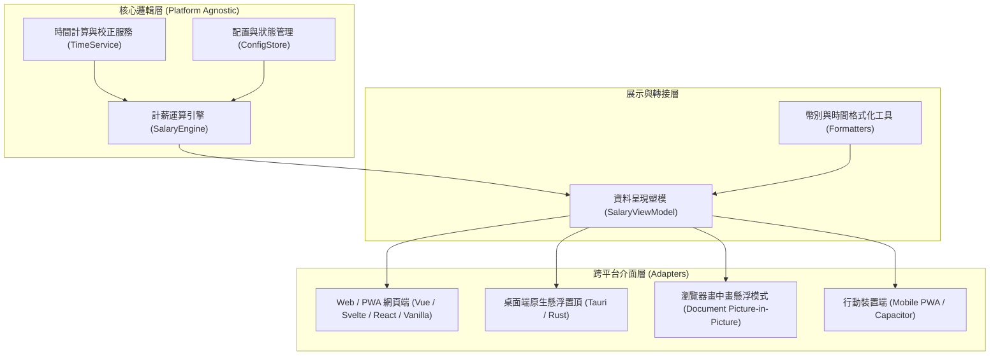
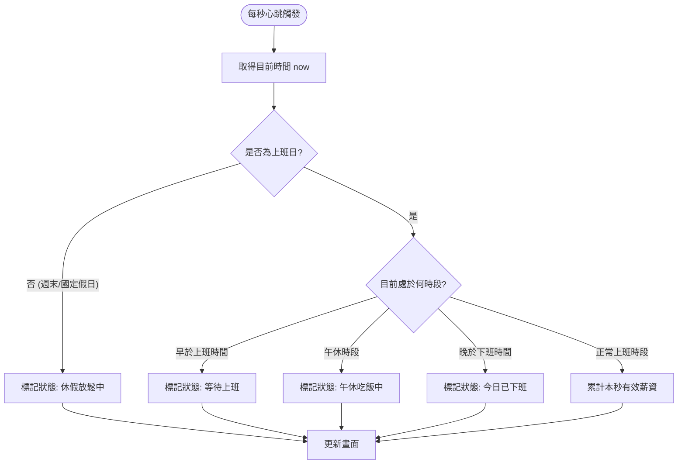

# 薪資時鐘 (Salary Clock) 系統架構設計書

本文件定義新版薪資時鐘的技術架構、核心演算法、模組邊界以及跨平台部署策略。

---

## 1. 系統分層架構

為了達到「一次撰寫核心邏輯，在多平台運行」的目標，系統採取嚴格的關注點分離 (Separation of Concerns)：



### 各模組職責說明

| 模組名稱 | 檔案規劃建議 | 職責說明 |
| :--- | :--- | :--- |
| **SalaryEngine** | `src/core/engine.js` | 純計算邏輯，不依賴 DOM 或作業系統 API。傳入時間與薪資設定，產出金額、進度與當前狀態。 |
| **TimeService** | `src/core/time.js` | 負責處理當月天數計算、工作日判定、午休時段排除與時間差校正。 |
| **ConfigStore** | `src/core/config.js` | 管理薪資設定、工作時間設定與使用者個人化偏好，並透過 StorageAdapter 持久化。 |
| **Formatters** | `src/utils/formatters.js` | 提供千分位數值、幣別符號、百分比及時分秒之顯示轉換。 |
| **UI Adapters** | `src/ui/*` | 各平台的前端呈現（例如懸浮 HUD、設定對話盒、瀏覽器畫中畫等）。 |

---

## 2. 跨平台技術方案評估

使用者希望未來能在「更多平台」使用。針對不同平台的情境與技術選型評估如下：

| 方案選項 | 目標平台 | 優勢 | 限制 / 考量 | 建議等級 |
| :--- | :--- | :--- | :--- | :--- |
| **1. Web + PWA** | 全平台（Windows, macOS, Linux, Android, iOS） | • 無須安裝，直接以瀏覽器開啟<br>• 可離線運行、支援添加到主畫面<br>• Laragon 環境即開即測 | • 瀏覽器視窗無法原生「穿透透明」或「永遠置頂」 | **第一階段核心推薦** |
| **2. Document Picture-in-Picture API** | 桌面瀏覽器 (Chrome / Edge 等) | • **網頁版也能在桌面右下角永遠置頂**<br>• 具備極佳的桌面懸浮體驗，無須安裝桌面軟體 | • 僅在 Chromium 核心現代瀏覽器支援<br>• 無法全背景穿透透明 | **網頁版進階推薦** |
| **3. Tauri (Rust + Web)** | 桌面平台 (Windows, macOS, Linux) | • 完美達成原版之「透明穿透、永遠置頂、無邊框、自訂拖曳」<br>• 打包體積極小 (< 10MB)，記憶體佔用遠低於 Electron<br>• 直接複用 Web 端前端程式碼 | • 需要 Rust 編譯環境 | **桌面專業版推薦** |
| **4. Electron** | 桌面平台 | • 生態系成熟，支援置頂與透明視窗 | • 執行檔肥大 (>80MB)，常駐耗記憶體 | 較不推薦 |

---

## 3. 核心演算法與流程邏輯

### 3.1 時間校準與防漂移機制
在前端開發中，若使用簡單的 `current_seconds += 1` 會因瀏覽器背景休眠或執行緒延遲導致累計時間不準確。因此，新版引擎必須以**絕對時間戳記**進行計算：

$$ \text{當前已過時間} = \text{Date.now()} - \text{起算時間點} $$

### 3.2 模式 A：全月連續制 (Continuous Monthly Mode)
```javascript
// 計算本月起點與終點時間戳記
function calculateMonthContinuous(monthlySalary, now = new Date()) {
    const year = now.getFullYear();
    const month = now.getMonth(); // 0 ~ 11
    
    // 本月第 1 天 00:00:00.000
    const startOfMonth = new Date(year, month, 1, 0, 0, 0, 0);
    // 下個月第 1 天 00:00:00.000 (即本月結束點)
    const endOfMonth = new Date(year, month + 1, 1, 0, 0, 0, 0);
    
    // 本月總毫秒數與已經過毫秒數
    const totalMs = endOfMonth.getTime() - startOfMonth.getTime();
    const elapsedMs = Math.min(Math.max(now.getTime() - startOfMonth.getTime(), 0), totalMs);
    
    const ratePerSecond = monthlySalary / (totalMs / 1000);
    const earned = (elapsedMs / totalMs) * monthlySalary;
    const progress = (elapsedMs / totalMs) * 100;
    
    return { earned, ratePerSecond, progress };
}
```

### 3.3 模式 B：工作日與上班時段制 (Workday Business Hours Mode)
此模式更精準貼近實際受薪階級日常：



#### 計算關鍵：
1. **本月總有效工時**：遍歷當月每一天，若為工作日，累加 `(每日工作時長 - 午休時長)`。
2. **有效秒薪**：`有效每秒薪資 = 月薪 ÷ (當月工作日天數 × 每日有效工時秒數)`。
3. **即時跳動控制**：僅在工作時段內進行即時毫秒/秒級跳動，其餘時間金額固定在已累積數值。

---

## 4. 資料模型與設定檔規範 (Schema Design)

為了讓未來各平台（Web `localStorage`、桌面 JSON、或跨裝置同步）相容，定義標準設定資料結構：

```json
{
  "version": "1.0.0",
  "salary": {
    "amount": 40000,
    "currency": "NT$",
    "currencyPosition": "prefix"
  },
  "mode": "workday", 
  "workdayConfig": {
    "workdays": [1, 2, 3, 4, 5],
    "workStartTime": "09:00",
    "workEndTime": "18:00",
    "lunchBreak": {
      "enabled": true,
      "startTime": "12:00",
      "endTime": "13:00"
    }
  },
  "ui": {
    "theme": "dark",
    "isCompact": false,
    "privacyMode": false,
    "decimalPlaces": 2,
    "accentColor": "#00ff99"
  }
}
```

---

## 5. 跨平台多型化落地建議流程

1. **第一階段（網頁原型與 PWA）**：
   - 於 `C:\laragon\www\salary-clock` 建立純前端應用。
   - 實現響應式介面，支援桌面視窗與手機瀏覽。
   - 引入 Web **Document Picture-in-Picture** API，讓網頁版在 Windows 桌面也能實現獨立懸浮小視窗。
2. **第二階段（桌面專用小工具包裝）**：
   - 以 Tauri 封裝第一階段完成之 Web 資源。
   - 透過 Tauri 視窗設定啟用無邊框、背景穿透透明與全域捷徑，完整復刻並超越原 Python 版本的視覺效果。
